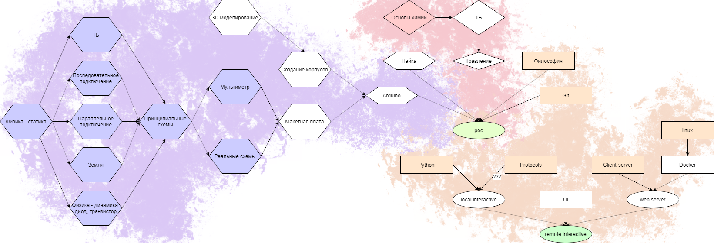

# Робототехника - ЛПН

Глобально, робототехника - это курс, а не кружок. В кружок можно походить, потом погулять, а потом снова вернуться.

Здесь сложнее: зная теорию, безусловно, ученик сможет присоединиться к курсу в любой момент времени.

Но без знания теории просто придти и влиться в процесс будет затруднительно, но всё же возможно.

Далее, робототехника - это минимум два разных курса: по роботам (физике) и технике (IT). Объединить их в один можно было бы на уровне университета, но в школе такой объём знаний ученики просто не вывезут.

Большую часть физики и IT можно дать ученикам на уроках физики и информатики соответственно, но это потребует корректировки программы, особенно по IT.

Так как в школе курс читается первый раз, мне неизвестно, сколько займёт времени каждая лекция. Мне также неизвестно, через сколько появятся результаты курса.


## Дерево технологий

[](https://sun9-43.userapi.com/c205820/v205820330/753b3/bOe5ilPHRxg.jpg)


## Цели

Цель ставится в зависимости от субъекта.

### Цели школы

- Повышение престижа школы.

    За счёт курса робототехники можно оборудовать школу нефункциональными, но красивыми вещами.
    
    Этот результат можно измерить в количестве и в качестве.
    
- Дешёвое улучшение быта.

    Готовые системы стоят дорого. Ещё дороже стоит труд профессиональных разработчиков. Цель курса робототехники - создание учениками дешёвых систем среднего качества.
    
    Этот результат можно измерить в количестве и в качестве.

### Цели ученика

Отдельно отмечу, что здесь нет цели "подготовиться к экзаменам". Ничего из нижеперечисленного не поможет получить хорошие оценки ни в учёбе, ни на экзамене. Однако, эти знания будут крайне полезными в университете. Я бы хотел их иметь, например, когда поступал.

- Подготовка к работе в радиофизике и IT.

    Школа не может подготовить ученика к работе на производстве. Это - задача университета. Однако, школа может дать базис, с которым стартовать в определённых областях будет намного проще.
    
    Для IT - это git, python, клиент-серверное взаимодействие и docker.
    
    Для радиофизики - это навыки пайки, разводки, 3D моделирования и работы с измерительными приборами.
    
    Этот результат нельзя измерить непосредственно ни в количестве, ни в качестве. Единственное, как я могу предложить оценить полезность курса - это отзывы от учеников, поступивших на учёбу/работу по указанным специальностям.
    
- Самореализация.

    Ученики должны уметь делать что-то, что нужно им лично. Должны создавать что-то, чего им не хватает.
    
    Этот результат можно попробовать оценить количественно и качественно, но только при наличии добровольной обратной связи от учеников. Не захотят они показывать свои собственные проекты - никто о них и не узнает.


## Программа IT

Выбор технологий основан на моём личном опыте и ежегодной статистике StackOverflow.
- [Статистика 2019 года](https://insights.stackoverflow.com/survey/2019)
- [Статистика 2018 года](https://insights.stackoverflow.com/survey/2018)
- [Статистика 2017 года](https://insights.stackoverflow.com/survey/2017)


#### Содержание
- [Лекция 1. Философия](#philosophy)
- [Лекция 2. Git](#git)
- [Лекция 3. Python - практика](#python-practice)
- [Лекция 4. Протоколы](#protocols)
- [Лекция 5. linux](#linux)
- [Лекция 6. linux - практика](#linux-practice)
- [Лекция 7. Client-server](#client-server)
- [Лекция 8. Docker](#docker)
- [Лекция 9. Ui](#ui)

### Лекция 1. Философия <a name="philosophy"></a>

#### Цели
- Определить высокоуровневые цели разработки.
- Показать эффективность гуглежа.
- Показать жизненный цикл приложения.

#### Тезисы
1. Зачем писать код? - Чтобы дёшево автоматизировать процесс.
1. Когда писать код? - Когда появится, что автоматизировать.
1. Как писать код? - Итерационно от худшего к лучшему.
1. Для кого писать код? - Для людей.
    - Читаемость:
        - Код - это документация, по которой компилятором составляется программа.
    - Модульность:
        - Код необходимо делить на логические модули.
        - Модуль отвечает только за одну вещь.
        - Модуль не даёт доступа к внутренней реализации.
        - Модуль не делает предположений о внешнем мире.
    - Расширяемость:
        - Код должен быть легко расширяем.
        - Расширение кода не должно вести к крашам.
1. Как писать код? - Погуглить > подумать > выдвинуть предположение > проверить предположение > повторить.
1. Как гуглить?
    - [Эрик Раймонд - Как правильно задавать вопросы](https://sitengine.ru//smart-question-ru.html)
    - Вывод компилятора осмысленнен.
    - Использовать английский язык.
1. Code style. Ide.
    - Взаимозаменяемость разработчиков.
    - Текстовый редактор vs ide.
    - Sublime/VS Code/Rider
1. Resources
	- https://habr.com
	- https://google.com
	- https://stackOverflow.com
	- https://youtube.com
	- Официальная документация по выбранной технологии
		- C# - https://msdn.com
		- python - https://python.org
		- etc
	- https://t.me/startupNeverSleeps и аналогичные чаты по технологиям.
	- Если надо качать крякнутые программы - только с https://rutracker.org Больше безопасных торрент-трекеров я не знаю. Клиентом советую брать Vuze, если машина тянет. Если нет - что-нибудь попроще, но с открытым кодом. На Вике есть список торрент клиентов.
1. Основы теории компиляторов. Трансляция. AST.


### Лекция 2. Git <a name="git"></a>

#### Цели
- Заставить полюбить git.
- Научить документировать репозитории в .md

#### Темы
1. Проблема версионности файлов.
1. Понятие коммита:
    - Дерево коммитов.
    - Тело коммита.
    - Сообщение коммита.
    - Ветка коммита.
    - Важность истории.
1. Определение репозитория.
1. Распределённость репозитория.
1. Конфликты в репозиториях.
1. Push/pull.
1. Markdown:
    - Указать отличия от wiki и tex.


### Лекция 3. Python - практика <a name="python-practice"></a>
#### Цели
- Настроить ide.
- Показать, куда писать код на питоне.
- Применить знания первых двух лекций.

#### Настройка
##### Sublime Text
В любом случае, советую его поставить. Просто посмотрите на главную гифку на его сайте - это очень удобно. Из перечисленных здесь этот - самый лёгкий для компьютера.

Плагины на него ставятся так:
- Нажать `Ctrl + Shift + P`. Большую часть операций с редактором можно делать через это меню.
- Вбить `Install Package Control`
- Согласиться. Это установит внутрь Sublime Text менеджер пакетов.
- Для доступа к менеджеру пакетов Надо нажать `Ctrl + Shift + P` и вбить `Package Control: install package`.
- Откроется новый дропдаун, в котором можно уже искать пакеты.

Бесплатен, установка простая. При использовании бесплатной версии иногда будет всплывать ненавязчивое окошко, мол, хочешь меня купить? Больше ограничений нет.

##### VS Code
Лёгкая IDE от Microsoft.

Для установки плагинов есть отдельное меню 'Extensions'.

Бесплатна, установка простая.

##### Rider
Мощная IDE от JetBrains.

На калькуляторе не запустится. Зато для мощного компьютера эта - лучший выбор.

Плагинов мало. Очень много уже предустановлено и идёт вместе с Rider. Более того, для c#/c++ это вообще единственный нормальный выбор.

Можно оформить бесплатную лицензию ученика, можно крякнуть. По кряку - см. лекция 1, раздел со ссылками на ресурсы.

##### Hello world

1. Установить python 3 с официального сайта. Не python 2, а именно версии 3 и выше.
1. Убедиться, что при установке python прописался в PATH. Для этого надо
	1. Открыть терминал
		- Если не знаете как - нажмите кнопку Пуск и найдите там `PowerShell`. Эта программа и будет вашим терминалом, пока не найдёте что-нибудь своё.
	1. Написать в терминале `python --help`
	1. Прочитать вывод.
		- Если в терминале говорится, что `python` не найден - погуглить 'python add path windows 10'
		- Если в терминале вывалился длинный текст помощи - всё ок.
1. Создать текстовый файл `hello_world.py`
1. Настроить табуляцию равной четырём пробелам. Если всё настроено верно, то при нажатии Tab должно вставляться четыре пробела.
1. Записать туда следующий код
```python
import math

print('hello world')

print(math.e)
```
1. Открыть терминал
1. Вбить в терминал `python /path/to/hello_world.py`
1. Будет выведено две строки. Первая - 'hello world', вторая - число Эйлера. Это число предоставляется библиотекой `math`. У Питона есть много библиотек. Чтобы узнать, что ещё может `math`, надо загуглить `python math lib`.
1. Библиотека `math` доступна сразу. Но в большинстве случаев перед использованием библиотек их надо найти и скачать.
	- Если попытаться заимпортить неустановленную библиотеку - Питон ругнётся.
	- Ищутся библиотеки только гуглежом и расспросами. В конце концов, вы должны найти имя библиотеки. Например, есть такая библиотека - `requests`.
	- Установка на Винде - вбить в терминал `pip install requests`. Pip - это пакетный менеджер, который ставится вместе с Питоном.
	- Установка на Линуксе - поставить через **свой** пакетный менеджер пакет `python-requests`. На Линуксе pip не используется.
	- После установки библиотека станет доступна для использования в любом коде.

#### Особенности python
- Строка не кончается символом точки с запятой.
- Интерполяция строк делается через f'{}'. То есть вместо `print('sin 2 is', math.sin(2))` можно писать `print(f'sin 2 is {math.sin(2)}')`. Вторая форма записи часто бывает намного более приятной для чтения.
- Не надо объявлять переменные явно. Однако, области видимости у переменных всё равно есть. Другими словами, в python нет бабблинга как в js. Если не понятно, что это значит - пока забей.
- Вложенность блоков задаётся пробелами. Примеры ниже равнозначны. Обратите внимание на отступы. Ни в pascal, ни в C они не важны. В python же слов begin/end вообще нет. `print` находится внутри цикла только потому что отступает от него на один Tab.

```pascal
// pascal
for i := 1 to 10 do
		begin
write(i)
	end
```

```c
// c
for (i = 1; i <= 10; i++) {
sum = sum + i;
		}
```

```python
# python
for i in range(1, 10):
	print(i)
```

#### Задачи
##### Основы

###### [max] 
Найти максимальный элемент в массиве.

###### [sum]
Взять два числа: x и y. Найти сумму целых чисел от x до y включительно.

###### [user]
Создать класс User. User имеет
- числовое поле "age",
- строковое поле "name",

Вывести одного пользователя на экран.

##### (Де)сериализация.

###### [ser]
Сохранить сериализованный экземпляр класса User в файл.

Совет: не `pickle lib`, а `json lib`.

###### [deser]
Прочитать сериализованный экземпляр класса User из файла.

Совет: не `pickle lib`, а `json lib`.

###### [http_get]

Получить от fake api данные. Совет: `requests lib`.

###### [http_post]

Записать в fake api данные. Совет: `requests lib`.

##### Перехват исключений.

###### [square]
Ввести число и вывести квадрат числа. Не пробрасывать никакие исключения пользователю.

###### [root]
Ввести число и вывести корень числа. Исключения полностью пробрасывать.
    
##### Модульность и расширяемость.

###### [tree]
Нарисовать ёлочку заданной высоты:
```
< 4
>
   *
  ***
 *****
*******
```

###### [another_tree]
Нарисовать ёлочку из заданного количества сегментов. Высота первого сегмента - две единицы, следующего - на одну больше.
```
< 3
>
   *
  ***
   *
  ***
 *****
   *
  ***
 *****
*******
```


### Лекция 4. Протоколы <a name="protocols"></a>

Лекция опциональна, читать только при необходимости разработки кастомного протокола.

Все темы в лекции будут затронуты кратко. С одной стороны, я не хочу закапываться в протоколы по уши; с другой - разработка систем без передачи данных между клиентом и сервером невозможна.

#### Цели
- Понять основы межсерверного взаимодействия.

#### Тезисы
1. Интернет - это сеть сетей.
1. LAN.
1. OSI:
    - x over y и матрёшки.
    - Физический уровень: определяет метод передачи данных (радиоволны, свет).
    - Канальный уровень: адресация в пределах локальной сети.
    - Сетевой уровень: адресация вне локальной сети.
    - Транспортный уровень: сегментирование и иногда порты.
    - Сеансовый уровень: разделяет потоки информации между пользователями.
    - Уровень представления: (де)сериализация данных.
    - Прикладной уровень: ввод данных пользователем.
1. Структура запроса:
    - Протоколы:
        - На физическом уровне нет протоколов.
        - Канальный: ethernet (local fire and forget).
        - Сетевой: ip (global fire and forget).
        - Транспортный: udp (порты)/tcp (и гарант доставки).
        - Я не знаю протоколы сеансового уровня.
        - Я не знаю протоколы уровня представления.
        - Прикладной: http(s)/ftp(s).
    - Роутинг:
        - Схема.
        - Глаголы.
        - IP адрес.
        - Dns.
        - Dns cache poisoning.
    - Request/response:
        - Передача параметров в строке запроса.
        - Передача параметров в теле запроса.
        - Status code.
        - Headers.
        - Body.
1. Шифрование:
    - P != NP - если ответ легко проверить, то легко ли его найти?
    - Односторонняя функция.
        - Хэш функция.


### Лекция 5. linux <a name="linux"></a>

#### Цели
- Первое знакомство с linux
- Основы shell для Docker

#### Тезисы

1. Open source.
    - vs free
    - vs wtfpl
1. Пакетирование.
    - Пакет.
    - Менеджер.
    - Опасности.
1. Структура /
    - /bin - exec
    - /etc - настройки
    - /home/username - хомяк
1. Права пользователей.
    - user
    - sudo
    - root
1. Posix. Всё есть файл.
    - file header
    - `aplay`
    - `cat dir`
    - Почему это не везде работает?
1. Регулярки.
1. Shell.
    - Pipeline.
    - Ключи.
    - `/bin/chmod -x /bin/chmod`?


# Лекция 6. linux - практика <a name="linux-practice"></a>

- Скопировать из каталога часть файлов по маске.
- Найти строку в файле по регулярке.
- Рекурсивно найти строки в файлах по регулярке.
- Запаковка и распаковка архива. .zip vs *

# Лекция 7. Client-server <a name="client-server"></a>

#### Цели

- Познакомиться с взаимодействием программ.
- Познать отличия локального программирования и боевого.

#### Тезисы

1. Типы:
    - звезда
    - проброс
    - p2p
1. Асинхронность.
1. Многопоточность.
1. Асинхронность vs многопоточность.
1. Аутентиикация vs авторизация.
1. Хранение секьюрных данных.
1. sql
    - ms sql
    - psql

# Лекция 8. Docker <a name="docker"></a>

#### Цели

- Научиться паковать сервера в докер-контейнеры
- Научиться пушить и деплоить контейнеры.

#### Тезисы

1. Docker host - виртуальное железо.
1. Docker image - система для железа.
1. Docker image tag - версия системы для железа.
1. Docker container - запушенная на хост система.
1. Проброс портов.
1. Билд
1. Ран.
1. Пуш.
    - Логин.
    - Тэгирование.

# Лекция 9. Ui <a name="ui"></a>

#### Цели

- Научиться рисовать кнопочки и сайтики.

#### Тезисы

1. create-react-app
1. component
    - life cycle
1. html
1. js
1. jsx
1. scss
1. material ui
